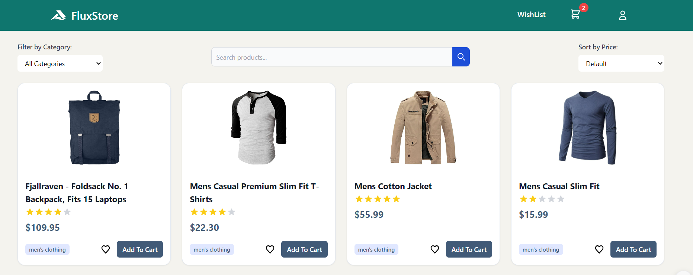
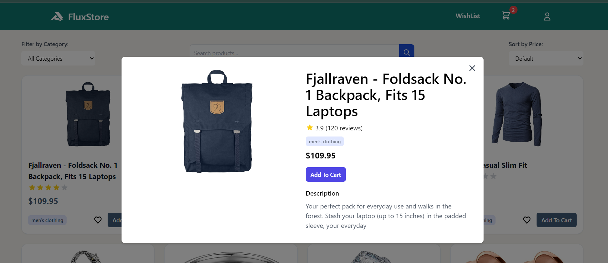

# FluxStore

FluxStore is a modern, responsive e-commerce web application built with Alpine.js and Tailwind CSS. It provides a seamless shopping experience with features like product filtering, sorting, and detailed product views.



## Table of Contents

- [Features](#features)
- [Technologies Used](#technologies-used)
- [Project Structure](#project-structure)
- [Setup Instructions](#setup-instructions)
- [Usage](#usage)
- [API Integration](#api-integration)
- [Customization](#customization)
- [Contributing](#contributing)
- [Contact Information](#contact-information)

## Features

- Responsive design for various screen sizes (mobile, tablet, desktop)
- Dynamic product listing with filtering and sorting capabilities
- Real-time search functionality for products
- Detailed product modal view with additional information
- Category-based filtering
- Price-based sorting (lowest to highest, highest to lowest)
- Loading states and error handling for improved user experience
<!-- - Wishlist functionality (UI implemented, logic to be added)
- Shopping cart preview (UI implemented, logic to be added) -->

## Technologies Used

- HTML5
- CSS3
- JavaScript (ES6+)
- [Alpine.js](https://alpinejs.dev/) - A lightweight JavaScript framework for composing behavior directly in your markup
- [Tailwind CSS](https://tailwindcss.com/) - A utility-first CSS framework for rapidly building custom user interfaces
- [Fake Store API](https://fakestoreapi.com/) - A free online REST API that provides fake e-commerce JSON data

## Project Structure

```
fluxstore/
│
├── public/
│   └── accusoft-svgrepo-com.svg
│
├── src/
│   ├── data/
│   │   ├── getCategories.js
│   │   └── getProducts.js
│   │
│   └── main.js
│
├── index.html
├── package.json
└── README.md
```

## Setup Instructions

1. Clone the repository:

   ```
   git clone https://github.com/MohauMushi/Module_2_MOHMUS379_JSE2407_GroupA_Mohau-Mushi_JSF01.git
   ```

2. Install the dependencies:

   ```
   npm install
   ```

3. Start the development server:

   ```
   npm run dev
   ```

4. Open your browser and visit `http://localhost:5173` (or the port number provided by your development server).

## Usage

1. **Browsing Products**:

- Upon loading, you'll see a grid of products fetched from the Fake Store API.
- Scroll through the products to view all available items.

2. **Filtering Products**:

- Use the category dropdown at the top of the page to filter products by category.
- Use the search bar to filter products by title. The filtering happens in real-time as you type.

3. **Sorting Products**:

- Use the sort dropdown to sort products by price (lowest to highest or highest to lowest).

4. **Viewing Product Details**:

- Click on a product card to open a modal with detailed information about the product.
- The modal includes the product image, title, price, category, rating, and full description.

5. **Adding to Cart**:

- (Functionality to be implemented) Click the "Add to Cart" button on a product card or in the product detail modal.

6. **Wishlist**:

- (Functionality to be implemented) Click the heart icon on a product card to add it to your wishlist.

7. **Responsive Design**:

- The application is fully responsive. Try resizing your browser window or opening it on different devices to see how the layout adapts.

## API Integration

FluxStore integrates with the Fake Store API to fetch product data. The integration is handled in the `src/data/` directory:

- `getCategories.js`: Fetches product categories
- `getProducts.js`: Fetches all products

To modify the API endpoints or add new API integrations, update these files or add new ones in the `src/data/` directory.

## Customization

1. **Styling**: The project uses Tailwind CSS for styling. To customize the look and feel, you can modify the Tailwind classes in `index.html` or update the Tailwind configuration file if you need to extend the default theme.

2. **Adding New Features**: To add new features, you can extend the Alpine.js data object in `src/main.js`. For larger features, consider creating new JavaScript modules and importing them into `main.js`.

3. **Modifying the Layout**: The main layout structure is in `index.html`. You can modify this file to change the overall layout of the application.

## Contributing

Contributions are welcome! Please feel free to submit a Pull Request.

1. Fork the repository
2. Create your feature branch (`git checkout -b feature/AmazingFeature`)
3. Commit your changes (`git commit -m 'Added some AmazingFeature'`)
4. Push to the branch (`git push origin feature/AmazingFeature`)
5. Open a Pull Request

## Contact Information

For any questions or feedback regarding this project, please reach out:

- Developer: **MOHAU MUSHI**
- Email: `david1mushi1@gmail.com`
- LinkedIn: [Mohau Mushi](https://www.linkedin.com/in/mohau-mushi/)
- GitHub: [MohauMushi](https://github.com/MohauMushi)
